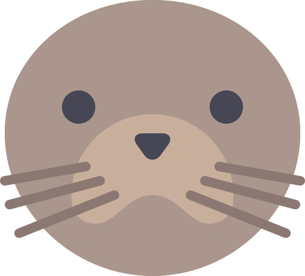
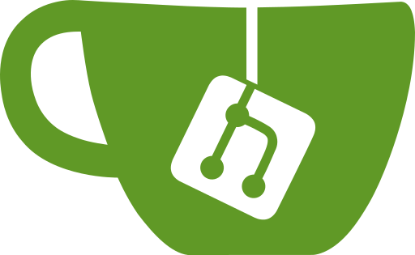
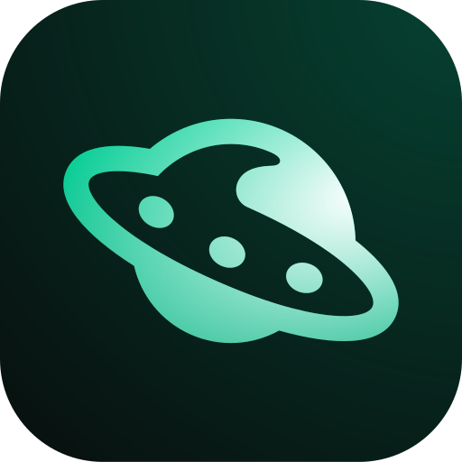
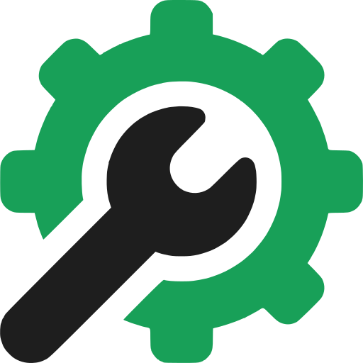
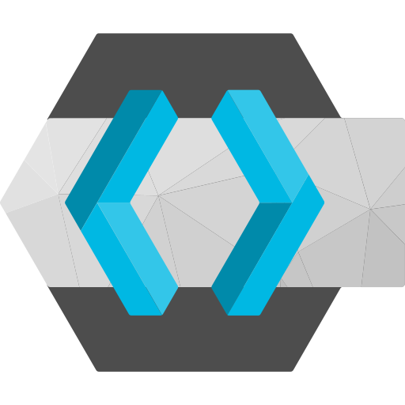
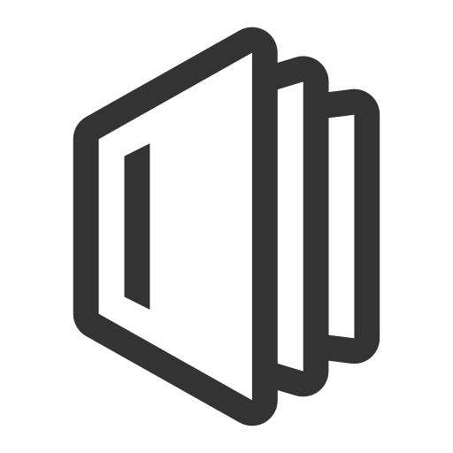
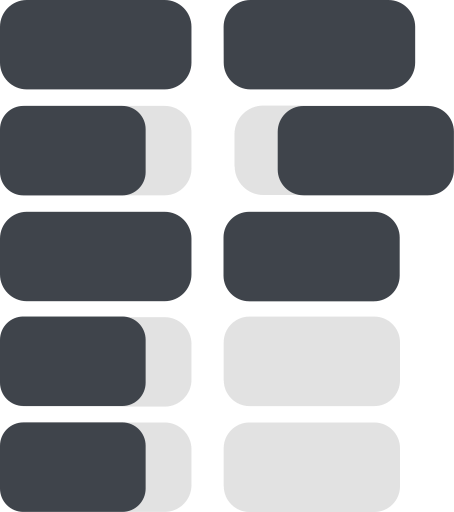
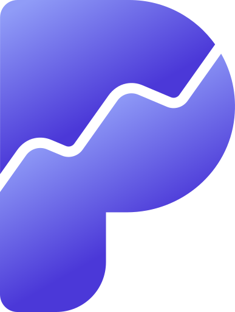

# Container Templates

Container-Vorlagen für die mStudio Container-Vorlagen-Funktion.

## Struktur

Jedes Template liegt in einem eigenen Ordner und besteht aus zwei Dateien:

```
<template-name>/
├── docker-compose.yml    # Docker Compose Konfiguration
├── manifest.yaml         # Metadaten, Inputs und Konfiguration
└── icon.svg / icon.png   # Icon (SVG bevorzugt, PNG als Fallback)
```

### docker-compose.yml

Standard Docker Compose Datei mit den Services, Volumes und Netzwerken des Templates. Umgebungsvariablen werden über `${VARIABLE}` referenziert und durch die im Manifest definierten User- und System-Inputs befüllt.

### manifest.yaml

Beschreibt das Template mit folgenden Feldern:

| Feld | Beschreibung |
|------|-------------|
| `manifestVersion` | Version der Manifest-Syntax (aktuell `1.0`) |
| `name` | Technischer Name des Templates |
| `version` | Angezeigte Version (z.B. `"2.x.x"`) |
| `tagline` | Kurzbeschreibung (de/en) |
| `description` | Ausführliche Beschreibung (de/en) |
| `developer` | Name des Entwicklers/Herstellers |
| `website` | Projekt-Website |
| `repository` | Source-Code Repository |
| `support` | Support-URL |
| `license` | Lizenz der Software |
| `icon` | Pfad zum Icon (SVG bevorzugt, PNG als Fallback) |
| `categories` | Kategorien: `productivity`, `development`, `ai`, `security`, `monitoring`, `communication`, `media`, `ecommerce` |
| `domains` | Domain-Zuordnung zu Services und Ports |
| `userInputs` | Vom Benutzer konfigurierte Werte |
| `systemInputs` | Automatisch vom System generierte Werte (Passwörter, Tokens) |

## Vorhandene Templates

| | Template | Beschreibung |
|---|----------|-------------|
|  | [anythingllm](anythingllm/) | All-in-One KI-Anwendung mit RAG |
|  | [bentopdf](bentopdf/) | PDF-Generierung als Service |
|  | [changedetection](changedetection/) | Website-Änderungen automatisch erkennen |
|  | [chatwoot](chatwoot/) | Open-Source Kundenkommunikationsplattform |
|  | [chroma](chroma/) | Vektordatenbank für KI-Anwendungen |
|  | [collabora](collabora/) | Online-Office-Suite für kollaboratives Arbeiten |
|  | [databasus](databasus/) | Einfacher Datenbank-Client im Browser |
|  | [directus](directus/) | Headless CMS mit PostgreSQL und Redis |
|  | [docmost](docmost/) | Kollaborative Wiki- und Dokumentationsplattform |
|  | [docuseal](docuseal/) | Open-Source Plattform für digitale Dokumentensignaturen |
|  | [dozzle](dozzle/) | Echtzeit Log-Viewer für Docker Container |
|  | [excalidraw](excalidraw/) | Virtuelles Whiteboard zum Skizzieren |
|  | [gitea](gitea/) | Leichtgewichtiger selbst gehosteter Git-Service |
|  | [gotenberg](gotenberg/) | Dokumentenkonvertierung als API |
|  | [healthchecks](healthchecks/) | Cron-Job und Hintergrundprozess-Monitoring |
|  | [hedgedoc](hedgedoc/) | Kollaborativer Markdown-Editor |
|  | [hoppscotch](hoppscotch/) | Open-Source API-Entwicklungsplattform |
|  | [immich](immich/) | Selbst gehostete Foto- und Videoverwaltung |
|  | [infisical](infisical/) | Open-Source Secret Management Plattform |
|  | [it-tools](it-tools/) | Praktische Online-Tools für Entwickler |
|  | [keycloak](keycloak/) | Open-Source Identity und Access Management |
|  | [langfuse](langfuse/) | Open-Source LLM-Observability und Analyse |
|  | [librechat](librechat/) | Multi-Provider KI-Chat-Plattform |
|  | [linkwarden](linkwarden/) | Kollaborativer Lesezeichen-Manager |
|  | [listmonk](listmonk/) | Newsletter und Mailing-Listen |
|  | [mailpit](mailpit/) | E-Mail-Test-Tool mit Web-Oberfläche |
|  | [mariadb](mariadb/) | Relationale Datenbank (MySQL-kompatibel) |
|  | [mautic](mautic/) | Open-Source Marketing-Automatisierung |
|  | [mealie](mealie/) | Selbst gehostete Rezeptverwaltung |
|  | [memos](memos/) | Leichtgewichtiger selbst gehosteter Notiz-Service |
|  | [miniflux](miniflux/) | Minimalistischer RSS-Feed-Reader |
|  | [n8n](n8n/) | Workflow-Automatisierung mit PostgreSQL-Backend |
|  | [nocodb](nocodb/) | Open-Source Airtable-Alternative |
|  | [ntfy](ntfy/) | Push-Benachrichtigungsdienst mit HTTP-API |
|  | [opencloud](opencloud/) | Open-Source Cloud-Plattform für Dateien und Zusammenarbeit |
|  | [opensearch](opensearch/) | Verteilte Such- und Analyse-Engine |
|  | [outline](outline/) | Kollaboratives Wissensmanagement und Wiki |
|  | [paperless](paperless/) | Dokumentenmanagement mit OCR |
|  | [papra](papra/) | Minimalistisches Dokumentenmanagement |
|  | [penpot](penpot/) | Open-Source Design- und Prototyping-Plattform |
|  | [planka](planka/) | Open-Source Kanban-Board für Projektmanagement |
|  | [plausible](plausible/) | Datenschutzfreundliche Web-Analytics |
|  | [pocket-id](pocket-id/) | Einfacher OpenID Connect Provider mit Passkeys |
|  | [postgresql](postgresql/) | Relationale Datenbank |
|  | [qdrant](qdrant/) | Hochperformante Vektordatenbank für KI-Anwendungen |
|  | [rallly](rallly/) | Open-Source Terminplanung und Abstimmungen |
|  | [reactive-resume](reactive-resume/) | Open-Source Lebenslauf-Builder |
|  | [rybbit](rybbit/) | Open-Source Web-Analytics Alternative |
|  | [solidtime](solidtime/) | Open-Source Zeiterfassung |
|  | [solr](solr/) | Enterprise-Suchplattform |
|  | [umami](umami/) | Datenschutzfreundliche Web-Analytics |
|  | [uptime-kuma](uptime-kuma/) | Uptime-Monitoring für Websites und Services |
|  | [vaultwarden](vaultwarden/) | Selbst gehosteter Passwort-Manager |
|  | [vikunja](vikunja/) | Open-Source Task- und Projektmanagement |

## Neues Template anlegen

1. Ordner mit dem Template-Namen erstellen
2. `docker-compose.yml` mit den benötigten Services anlegen
3. `manifest.yaml` mit allen Metadaten und Input-Definitionen erstellen
4. `icon.svg` hinzufügen (Quelle: [dashboard-icons](https://github.com/homarr-labs/dashboard-icons), Apache-2.0)
5. Variablen in der `docker-compose.yml` über `userInputs` und `systemInputs` im Manifest definieren